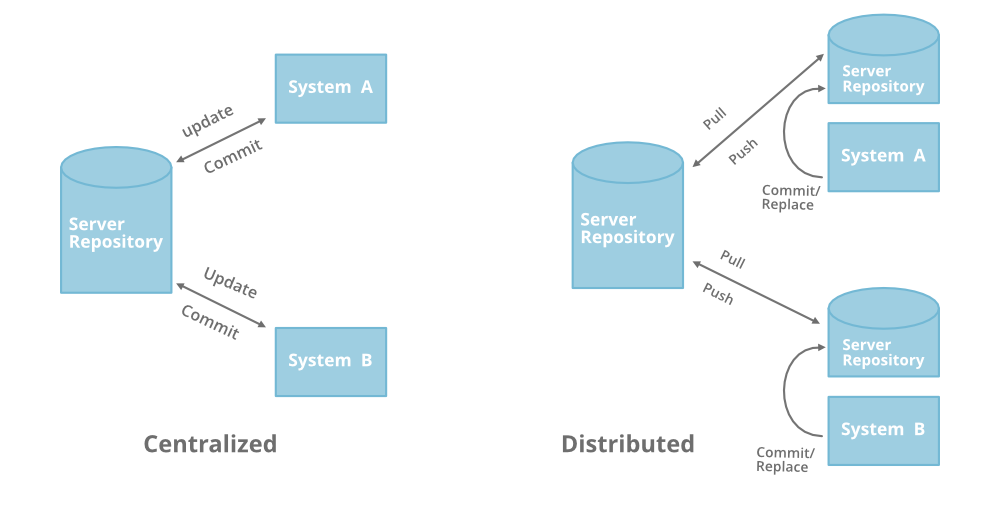
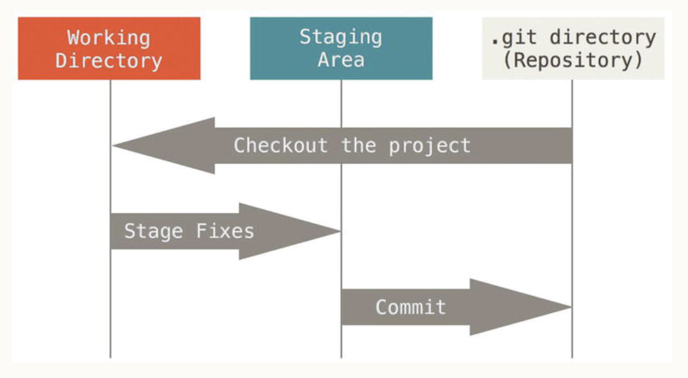

<h1 id="top">About Version Control System</h1>
You can think of a **version control system (VCS)** as a kind of "database". It lets you save a **snapshot** of your complete project at any time you want. When you later take a look at an older **snapshot** (let's start calling it **"version"**), your VCS shows you exactly how it differed from the previous one.

## CVCS vs DVCS
- Version control is a system that records changes to a file or set of files over time so that you can recall specific versions later.
- Version Control Systems (**VCS**): 
  - Local Version Control Systems (**LVCS**)
    - A database on your hard disk that stores changes to files.
  - Centralized Version Control System (**CVCS**)
    - A single server stores all changes and file versions, which can be accessed by various clients.
  - Distributed Version Control System (**DVCS**)
    - A DVCS allows clients to create mirrored repositories. These data backups can be easily be placed on the server to replace any lost information.  
<br>


## Git History
>By far, the most widely used modern version control system in the world today is **Git**. **Git** is a mature, actively maintained open source project originally developed in **2005** by **Linus Torvalds**, the famous creator of the Linux **operating system kernel**.
- Linux Kernel VCS (**Linus Torvalds**)
  - **1991-2002**: Patches and archived files
  - **2002-2005**: BitKeeper (BitKeeper is a DVCS)
  - **2005**: Git
    - Speed
    - Simple Design
    - Non-linear Development
    - Fully Distributed
    - Handle Large Projects

## Git Basics
- Git is a DVCS that stores data in a file system made up of snapshots.
- Snapshots, not differences
- Nearly Every Operation Is Local
- Git Has Integrity
  - The mechanism that Git uses for this checksumming is called a SHA-1 hash.
  - Git stores everything in its database not by filename, but by the hash value of its contents.
- Git Generally Only Adds Data
- There are three local states related to files being managed by Git:
  - **Working Directory:** the directory or folder on your computer that holds all the project or application files. Files within the working directory, may or may not be managed by Git. However, Git is aware of them.
  - **Staging Area:** In-between is the Git staging area, often referred to as the Git index, that is a holding area for queueing up changes for the next commit.
  - **Git Repository or Commit History:** The Git repository manages the Git commit history, that is all the changes that are finalized and permanently part of the Git repository.<br>


The basic Git workflow goes something like this:
- You modify files in your **Working Directory**.
- You stage the files, adding snapshots of them to your **Staging Area**.
  - ```git add <filename>```
- You do a commit, which takes the files as they are in the staging area and stores that snapshot permanently to your **Git Directory**.
  - ```git commit -m "Commit message"```
    - ```-m``` flag is used to add a message to the commit.
  - ```git commit -a -m "Commit message"```
    - ```-a``` flag is used to skip the staging area and commit all the changes in the working directory.
  

**Reference:** https://git-scm.com/book/en/v2/

<div align="right"><a href="02_Installing_Git.md" targert="_blacnk"></a>
<a href="#top" targert="_blacnk"></a>

</div>