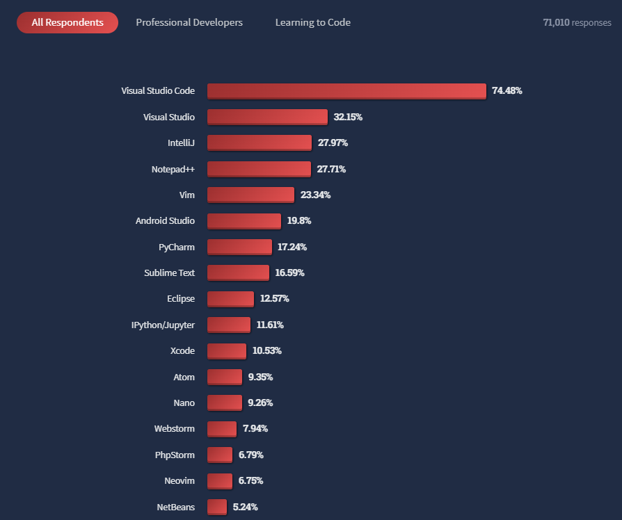

# VSCode
Visual Studio Code, also commonly referred to as VS Code, is a source-code editor made by Microsoft for Windows, Linux and macOS. Features include support for debugging, syntax highlighting, intelligent code completion, snippets, code refactoring, and embedded Git. Visual Studio Code is a very popular coding editor used by millions of developers around the world.

The editor has rapidly gained popularity among developers, ranking as the most popular development environment overall in [Stack Overflow’s 2022 Developer Survey](https://survey.stackoverflow.co/2022/#integrated-development-environment).



## Installation
### Windows, Linux, and MacOS
Visual Studio Code is free and available on your favorite platform - **Linux**, **macOS**, and **Windows**. Download it from [here](https://code.visualstudio.com/download) and install it on your machine.

### WSL
To use Visual Studio Code with the **Windows Subsystem for Linux (WSL)**, please install Visual Studio Code in Windows and uninstall the Linux version in WSL. You can then use the code command in a WSL terminal just as you would in a normal command prompt.

### What is WSL?
The Windows Subsystem for Linux lets developers run a GNU/Linux environment -- including most command-line tools, utilities, and applications -- directly on Windows, unmodified, without the overhead of a traditional virtual machine or dualboot setup.
**You can:**
- Choose your favorite GNU/Linux distributions from the [Microsoft Store](https://aka.ms/wslstore).
- Run common command-line tools such as ```grep```, ```sed```, ```awk```, or other ELF-64 binaries.
- Run Bash shell scripts and GNU/Linux command-line applications including:
  - **Tools:** vim, emacs, tmux
  - **Languages:** [NodeJS](https://docs.microsoft.com/en-us/windows/nodejs/setup-on-wsl2), Javascript, [Python](https://docs.microsoft.com/en-us/windows/python/web-frameworks), Ruby, C/C++, C# & F#, Rust, Go, etc.
  - **Services:** SSHD, [MySQL](https://docs.microsoft.com/en-us/windows/wsl/tutorials/wsl-database), Apache, lighttpd, [MongoDB](https://docs.microsoft.com/en-us/windows/wsl/tutorials/wsl-database), [PostgreSQL](https://docs.microsoft.com/en-us/windows/wsl/tutorials/wsl-database).
  
[Click to read more](https://docs.microsoft.com/en-us/windows/wsl/about)

## Extensions
There are literally thousands of extensions in the VS Code marketplace with new ones coming seemingly every single day! Extensions can serve many purposes. From extension-like UI themes to programming language support, debugging, Git integration, and even Spotify players! Extensions are very important because they make the VS Code what it currently is, a very capable piece of software. Without them, VS Code would be not much beyond glorified text editor with good design and basic autocompletion here and there.

Extensions are really important to customizing your software to suit your personal needs. So please use them!

For Git we will use the following extensions:
- Git Graph: https://marketplace.visualstudio.com/items?itemName=mhutchie.git-graph
- Git Lens: https://marketplace.visualstudio.com/items?itemName=eamodio.gitlens

We highly recommend you to install the following extensions as well for a better theme (this is a personal preference and completely optional):
- [Material Theme Icons](https://marketplace.visualstudio.com/items?itemName=Equinusocio.vsc-material-theme-icons)
- [Material Theme](https://marketplace.visualstudio.com/items?itemName=Equinusocio.vsc-material-theme)
- [Material Icon Theme](https://marketplace.visualstudio.com/items?itemName=PKief.material-icon-theme)
- [Dark + Material](https://marketplace.visualstudio.com/items?itemName=vangware.dark-plus-material)
