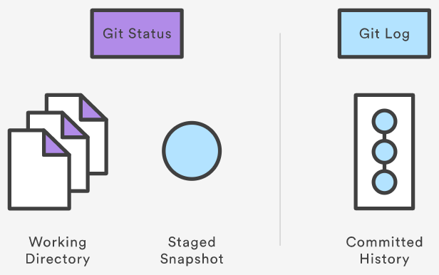
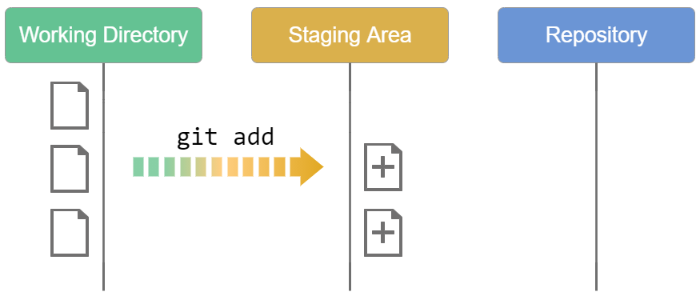
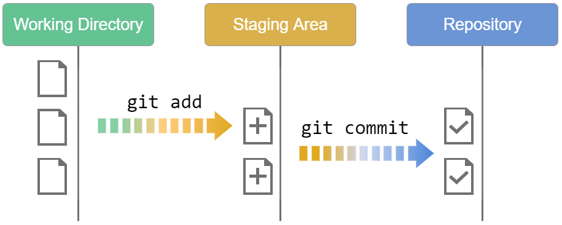

## Git Basics - Content
- <a href="#Getting_a_Git_Repository">Configure and Initialize a Repository</a>
  - <a href="#git_init">`git init`</a>
  - <a href="#git_clone">`git clone`</a>
- <a href="#git_url">Git URLs</a>
  - <a href="#git_url">`HTTP`</a>
  - <a href="#git_url">`SSH`</a>
- <a href="#Recording_Changes">Recording Changes to the Repository</a>
  - <a href="#git_status">`git status`</a>
    - <a href="#git_status_s">`git status -s or git status --short`</a>
  - <a href="#git_log">`git log`</a>
  - <a href="#git_add">`git add`</a>
  - <a href="#git_reset">`git reset`</a>
  - <a href="#git_commit">`git commit`</a>
  - <a href="#gitignore">`.gitignore`</a>
  - <a href="#git_diff">`git diff`</a>


<h2 id="Getting_a_Git_Repository">Getting a Git Repository</h2>
You typically obtain a Git repository in one of two ways:
<h3 id="git_init">1. Initializing a Repository in an Existing Directory</h3>
If you have a project directory that is currently not under version control and you want to start controlling it with Git, you first need to go to that project’s directory and initializing git there:
```bash 
cd /MyProject
git init
```

This creates a new subdirectory named **`.git`** that contains all of your necessary repository files — a Git repository skeleton. At this point, nothing in your project is **tracked** yet. See **[Git Internals](https://git-scm.com/book/en/v2/ch00/ch10-git-internals)** for more information about exactly what files are contained in the **`.git`** directory you just created.

<h3 id="git_clone">2. Cloning an Existing Repository</h3>
If you want to get a copy of an existing Git repository — for example, a project you’d like to contribute to — the command you need is:
```bash 
git clone <Repo URL>
```
That creates a directory named \<Repo Name>, initializes a **`.git`** directory inside it.<br>
you can specify the **new directory name** as an additional argument:
```bash 
git clone <Repo URL> <Your Directory Name>
```

Git has a number of different transfer protocols you can use. The common way, uses the **`https://`** protocol, but you may also see **`git://`** or **`user@server:path/to/repo.git`**, which uses the **SSH transfer protocol**. **[Getting Git on a Server](https://git-scm.com/book/en/v2/ch00/_getting_git_on_a_server)** will introduce all of the available options the server can set up to access your Git repository and the pros and cons of each.


<h2 id="git_url">Git URLs</h2>

Git has its own URL syntax which is used to pass remote repository locations to Git commands.
**Git URL protocols:**
1. **SSH: Secure Shell (SSH)** is a ubiquitous authenticated network protocol that is commonly configured by default on most servers. Because **SSH** is an authenticated protocol, you'll need to establish credentials with the hosting server before connecting.

2. **HTTP: Hyper text transfer protocol.** The protocol of the web, most commonly used for transferring web page HTML data over the Internet. Git can be configured to communicate over HTTP.


<h2 id="Recording_Changes">Recording Changes to the Repository</h2>

All files in your working directory can be in one of two states: **tracked** or **untracked**. **Tracked files** are files that were in the last snapshot. they can be **unmodified**, **modified**, or **staged**. 
##### In short, tracked files are files that Git knows about.

**Untracked files** are everything else — any files in your working directory that were not in your last snapshot and are not in your **staging area**. When you first **clone a repository**, all of your files will be **tracked and unmodified** because Git just checked them out and you haven’t edited anything.

As you edit files, Git sees them as **modified**, because you’ve changed them since your last commit. As you work, you selectively stage these modified files and then commit all those staged changes, and the cycle repeats.<br>


<h2 id="git_status">Checking the Status of Your Files</h2>

The main tool you use to determine which files are in which state is the **`git status`** command. If you run this command **directly after a clone**, you should see something like this:
```bash 
$ git status
On branch master
Your branch is up-to-date with 'origin/master'.
nothing to commit, working tree clean
```
This means you have a clean working directory. in other words, none of your tracked files are modified. Git also doesn’t see any untracked files, or they would be listed here. Finally, the command tells you which branch you’re on, that branch is always **`master`**, which is the default.

Let’s add a new file to the project, a simple **`README.md`** file. If the file didn’t exist before, and you run **`git status`**, you see your **untracked file** like:
```bash 
$ git status
On branch master
Your branch is up-to-date with 'origin/master'.
Untracked files:
  (use "git add <file>..." to include in what will be committed)

    README.md

nothing added to commit but untracked files present (use "git add" to track)
```
You can see that your new **`README.md`** file is **untracked**, because it’s under the **Untracked files heading** in your status output. Untracked basically means that Git sees a file you didn’t have in the previous **snapshot (commit)**, and which hasn’t yet been staged.

<h3 id="git_status_s">Short Status</h3>

Git also has a **short status flag** so you can see your changes in a more compact way. If you run **`git status -s`** or **`git status --short`** you get a far more simplified output from the command:
```bash 
$ git status -s
 M README
MM Rakefile
A  lib/git.rb
M  lib/simplegit.rb
?? LICENSE.txt
```
New files that *aren’t tracked* have a **`??`** next to them, new files that have been **added to the staging area** have an **`A`**, **modified files** have an **`M`** and so on. There are two columns to the output — the **left-hand column** indicates the **status of the staging area** and the **right-hand column** indicates the **status of the working tree**. So for example in that output, the **`README`** file is **modified** in the working directory but **not yet staged**, while the **``lib/simplegit.rb``** file is **modified and staged**. The **`Rakefile`** was **modified**, **staged** and then **modified again**, so there are changes to it that are both staged and unstaged.

<h2 id="git_log">Information of the commit</h2>

The **`git log`** command displays committed snapshots. It lets you list the project history, filter it, and search for specific changes. While **`git status`** lets you inspect the working directory and the staging area, **`git log`** only operates on the committed history.<br>


Log output can be customized in several ways, some of the most common configurations of **`git log`** are presented below.
- **`git log`:** Display the entire commit history using the default formatting. If the output takes up more than one screen, you can use **Space** to **scroll** and **`q`** to **exit**.
- **`git log -n <limit>`:** Limit the number of commits to display. For example, **`git log -n 3`** will display only 3 commits.
- **`git log --oneline`:** Condense each commit to a single line. This is useful for getting a high-level overview of the project history.
- **`git log --stat`:** Along with the ordinary **`git log`** information, include which files were altered and the relative number of lines that were added or deleted from each of them.
- **`git log <file>`:** Only display commits that include the specified file. This is an easy way to see the history of a particular file.
- **`git log -p`:** Display the patch representing each commit. This shows the full diff of each commit, which is the most detailed view you can have of your project history.
- **`git log -p <file>`:** Display the patch representing for <file>
- **`git log --author="<pattern>"`:** Search for commits by a particular author. The argument can be a plain string or a regular expression.
- **`git log --grep="<pattern>"`:** Search for commits with a commit message that matches, which can be a plain string or a regular expression.
- **`git log --graph --decorate`:** The **`--graph`** flag that will draw a text based graph of the commits on the left hand side of the commit messages. **`--decorate`** adds the names of branches or tags of the commits that are shown.


<h2 id="git_add">Tracking New Files</h2>

In order to begin **tracking a new file**, you use the command **`git add <File NAME>`** .For example, to begin **tracking** the **`README.md`** file: **`git add README.md`**.

If you run your status command again, you can see that your `README.md` file is now **tracked and staged to be committed**:
```bash   
$ git status
On branch master
Your branch is up-to-date with 'origin/master'.
Changes to be committed:
  (use "git restore --staged <file>..." to unstage)

    new file:   README.md
```

<p id="git_reset"></p>

##### Opposite side of **`git add`** is **`git reset`**, we use it to unstage: **```git reset <File Name>```**.

**`git add`** is a multipurpose command:
1. you use it to **begin tracking new files, to stage files.**
2. If you **modify** a file after you run **`git add`**, you have to run **`git add`** again to **stage** the latest version of the file.

**Some Trick in `git add`**
add all files: **```git add . ```**
add all files with \<py> postfix: **```git add "*.<py>"```**


<h2 id="git_commit">Committing Your Changes</h2>

Now that your **staging area** is set up the way you want it, you can **commit** your changes. **Remember** that anything that is still **unstaged** — any files you have **created or modified** that you haven’t run **`git add`** on since you edited them — won’t go into this commit. They will stay as **modified** files on your disk. you’re ready to commit your changes. The simplest way to commit is to type **`git commit`**.
The default editor of the git config, will displays the following text (this example is a Vim screen):
```bash 
# Please enter the commit message for your changes. Lines starting
# with '#' will be ignored, and an empty message aborts the commit.
# On branch master
# Your branch is up-to-date with 'origin/master'.
#
# Changes to be committed:
#	new file:   README
#	modified:   CONTRIBUTING.md
#
~
~
~
```
When you exit the editor, Git creates your commit with that commit message (with the comments and diff stripped out).



**Alternatively, you can type your commit message inline with the commit command by specifying it after a **`-m`** flag, like this:**
```bash 
git commit -m "Your Commit"
```
Now you’ve created your first commit! You can see that the commit has given you some output about itself: which **branch** you committed to, what **SHA-1 checksum** the commit has, how many files were changed, and statistics about lines added and removed in the commit.
Remember that the commit records the snapshot you set up in your staging area. Anything you didn’t stage is still sitting there modified; you can do another commit to add it to your history. Every time you perform a commit, you’re recording a snapshot of your project that you can revert to or compare to later.

##### Options: 
- **`git commit`:** Commit the staged snapshot. This will launch a text editor prompting you for a commit message. After you’ve entered a message, save the file and close the editor to create the actual commit.
- **`git commit -a`:** Commit a snapshot of all changes in the working directory. This only includes modifications to tracked files (those that have been added with git add at some point in their history).
- **`git commit -m "commit message"`:** A shortcut command that immediately creates a commit with a passed commit message. By default, git commit will open up the locally configured text editor, and prompt for a commit message to be entered. Passing the **`-m`** option will forgo the text editor prompt in-favor of an inline message.
- **`git commit -am "commit message"`:** A power user shortcut command that combines the **`-a`** and **`-m`** options. This combination immediately creates a commit of all the staged changes and takes an inline commit message.
- **`git commit --amend`:** This option adds another level of functionality to the commit command. Passing this option will modify the last commit. Instead of creating a new commit, staged changes will be added to the previous commit. This command will open up the system's configured text editor and prompt to change the previously specified commit message.

<h2 id="gitignore">Ignoring Files</h2>

Often, you’ll have a class of files that you don’t want Git to automatically add or even show you as being untracked. These are generally automatically generated files such as log files or files produced by your build system. In such cases, you can create a file listing patterns to match them named **`.gitignore`**. Here is an example **`.gitignore`** file:
```bash
$ cat .gitignore
*.[oa]
*~
```
with **`cat <File Name>`**, we can see the content of the file inline.
The first line tells Git to ignore any files ending in **`.o`** or **`.a`** — object and archive files that may be the product of building your code. The second line tells Git to ignore all files whose names end with a tilde **`~`**, which is used by many text editors such as Emacs to mark temporary files.

#### The rules for the patterns you can put in the .gitignore file are as follows:
- Blank lines or lines starting with **`#`** are ignored.
- You can negate a pattern by starting it with an exclamation point **`(!)`**.
- You can end patterns with a forward slash **`(/)`** to specify a directory.
- You can start patterns with a forward slash **`(/)`** to avoid recursivity.

```bash
# ignore all .a files
*.a

# but do track lib.a, even though you're ignoring .a files above
!lib.a

# only ignore the TODO file in the current directory, not subdir/TODO
/TODO

# ignore all files in any directory named build
build/

# ignore doc/notes.txt, but not doc/server/arch.txt
doc/*.txt

# ignore all .pdf files in the doc/ directory and any of its subdirectories
doc/**/*.pdf
```

For a list of patterns that can be used in `.gitignore` files, see [this link](https://git-scm.com/docs/gitignore#_pattern_format), [Atlassian gitignore guide](https://www.atlassian.com/git/tutorials/saving-changes/gitignore) or [Github](https://github.com/github/gitignore).

<h2 id="git_diff">Viewing Your Staged and Unstaged Changes</h2>

If the **`git status`** command is too vague for you — you want to know exactly what you changed, not just which files were changed — you can use the **`git diff`** command., you’ll probably use it most often to answer these two questions: 
1. What have you changed but not yet staged? 
2. what have you staged that you are about to commit(snapshot)? 

Although **`git status`** answers those questions very generally by listing the file names, **`git diff`** shows you the exact lines added and removed — the patch, as it were.

Let’s say you edit and stage the **`README.md`** file again and then edit the **`CONTRIBUTING.md`** file without staging it. If you run your **`git status`** command, you once again see something like this:
```bash
$ git status
On branch master
Your branch is up-to-date with 'origin/master'.
Changes to be committed:
  (use "git reset HEAD <file>..." to unstage)

    modified:   README.md

Changes not staged for commit:
  (use "git add <file>..." to update what will be committed)
  (use "git checkout -- <file>..." to discard changes in working directory)

    modified:   CONTRIBUTING.md
```
To see what you’ve changed but not yet staged, type **`git diff`** with no other arguments:
```bash
$ git diff
diff --git a/CONTRIBUTING.md b/CONTRIBUTING.md
index 8ebb991..643e24f 100644
--- a/CONTRIBUTING.md
+++ b/CONTRIBUTING.md
@@ -65,7 +65,8 @@ branch directly, things can get messy.
 Please include a nice description of your changes when you submit your PR;
 if we have to read the whole diff to figure out why you're contributing
 in the first place, you're less likely to get feedback and have your change
-merged in.
+merged in. Also, split your changes into comprehensive chunks if your patch is
+longer than a dozen lines.
```
That command compares what is in your **working directory** with what is in your **staging area**. The result tells you the changes you’ve made that you haven’t yet staged.
If you want to see what you’ve **staged** that will go into your next **commit**, you can use **`git diff --staged`** or **`git diff --cached`**(**`--staged`** and **`--cached`** are synonyms). This command compares your **staged** changes to your **last commit**:
```bash
$ git diff --staged
diff --git a/README.md b/README.md
new file mode 100644
index 0000000..03902a1
--- /dev/null
+++ b/README
@@ -0,0 +1 @@
+My Project
```
It’s important to note that **`git diff`** by itself doesn’t show all changes made since your last commit — only changes that are still unstaged. If you’ve staged all of your changes, **`git diff`** will give you no output.

**Note**
**Git Diff in an External Tool**
We will continue to use the **`git diff`** command in various ways throughout the rest of the book. There is another way to look at these diffs if you prefer a graphical or external diff viewing program instead. If you run **`git difftool`** instead of **`git diff`**, you can view any of these diffs in software like emerge, vimdiff and many more (including commercial products). 
<h3 id="VSCode_difftool">VScode as difftool</h3>

Run the command **`git config --global --edit`** to edit the global config, and add the following:
```bash
[core]
  editor = code --wait

[diff]
  tool = vscode

[difftool "vscode"]
  cmd = code --wait --diff $LOCAL $REMOTE
```
If you already have **`[core]`** section, just add the **`[diff]`** and **`[difftool]`** sections to it.
